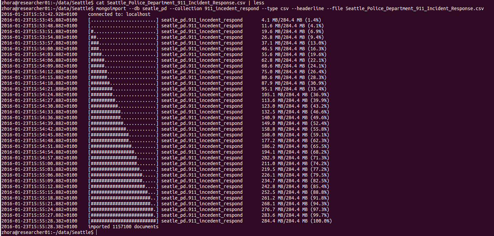
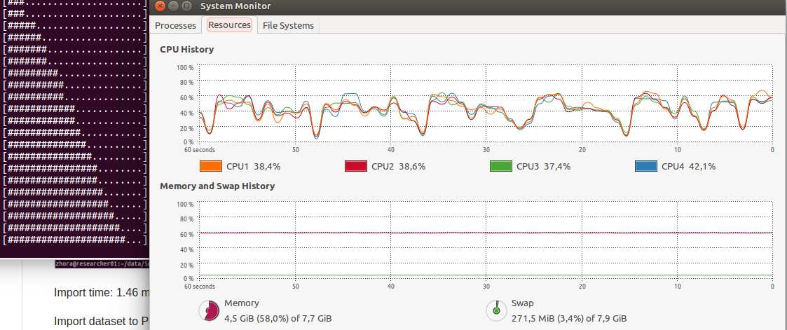
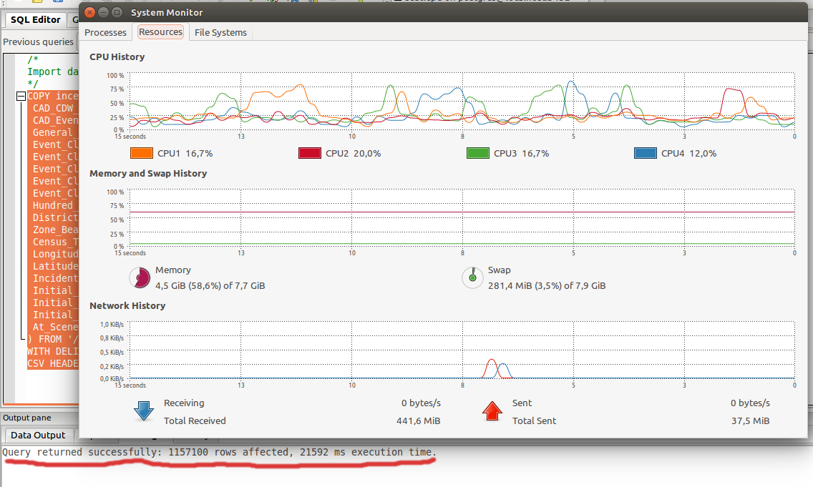

Exploration Data Analize (EDA)
--------------------------------------------------------------------------------
- - - - - - - - - - - - - - - - - - - - - - - - - - - - - - -  - - - - - - - - -
Oleksandr Zhorniak
v1.0, 2015-16

Task 2 - Import Big Dataset to Databases. And count some data using DB tools.
- - - - - - - - - - - - - - - - - - - - - - - - - - - - - - -  - - - - - - - - -
Using databases:

1. MongoDB 3.2.

2. Postgresql 9.3.

For testing dataset I had found and downloaded from the Seatle Goverment site (data.seattle.gov)
 the report dataset with title ["Seattle Police Department 911 Incident Response"](https://data.seattle.gov/Public-Safety/Seattle-Police-Department-911-Incident-Response/3k2p-39jp), file in a .cvs format.

Task 2a. Import dataset to MongoDB and Postgresql
- - - - - - - - - - - - - - - - - - - - - - - - - - - - - - -  - - - - - - - - -

  Import dataset to MongoDB.

  For importing the dataset, that I mentioned above into the Mongodb database I'll use
  mongoimport tool that command for import data to MongoDB:

  mongoimport --db seatpepd --collection incedent_response_911 --type csv --headerline --file Seattle_Police_Department_911_Incident_Response.csv

  Result importing dataset to MongoDB.

  Import time: 1.46 min.

CPU and Memory using during import dataset.

 Import dataset to Postgresql.

Postgresql it's the RDBMS. Since release 9.3 version, Postgresql supporting some functions of NoSQL technology for working with JSON documents. But today I'll be using Postgresql as the classic RDBMS. That's why I need to create the database and table inside the Postgresql and after that I'll can import my dataset inside that.  [First script](scripts/create_table_incedent_esponce_911.sql)  to create Database and Table, after that I can copy Dataset into Database using  [Second script](scripts/copy_incedent_esponce_911.sql).

  Result importing to Postgresql:

  Query returned successfully: 1157100 rows affected, 21592 ms execution time.(~ 0.22 sec. Winer!).

Task 2b. Calculate imported records.
  - - - - - - - - - - - - - - - - - - - - - - - - - - - - - - -  - - - - - - - -

Both Database calculated 1157100 rows.

Task 2c. Create some simple Aggregation on both Databases.
- - - - - - - - - - - - - - - - - - - - - - - - - - - - - - -  - - - - - - - -
So! Now I created simple aggregation function it's the group function wich to aggregate each type of "Event Clearance Group" and calculate how many types(and rows that types) of "Event Clearance Group" we have in collection.

Here the grouping script:

[`scripts/q1_group.js`]

Ok! Then we should to apply this command in bash:

mongo --quiet q1_group.js > result_group_q1.txt

Finally, we have the such result:Task 2d. Working with GeoJSON objects.

`scripts/result_group_q1.txt`   

- - - - - - - - - - - - - - - - - - - - - - - - - - - - - - -  - - - - - - - -

Find in Internet GeoJSON objects, import to database and create 4 geospatial queries(at list forPoint, LineString and Polygon)
