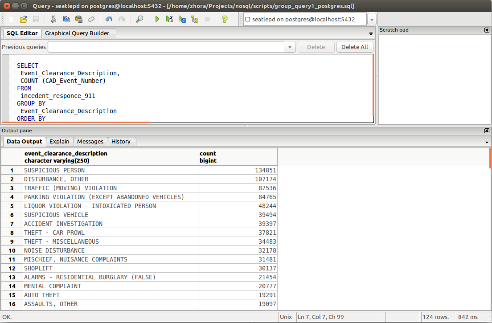

Exploration Data Analize (EDA)
--------------------------------------------------------------------------------
- - - - - - - - - - - - - - - - - - - - - - - - - - - - - - -  - - - - - - - - -
Oleksandr Zhorniak
v1.0, 2015-16

Task 2 - Import Big Dataset to Databases. And count some data using DB tools.
- - - - - - - - - - - - - - - - - - - - - - - - - - - - - - -  - - - - - - - - -
Using databases:

1. MongoDB 3.2.

2. Postgresql 9.3.

For testing dataset I had found and downloaded from the Seatle Goverment site (data.seattle.gov)
 the report dataset with title ["Seattle Police Department 911 Incident Response"](https://data.seattle.gov/Public-Safety/Seattle-Police-Department-911-Incident-Response/3k2p-39jp), file in a .cvs format.

Task 2a. Import dataset to MongoDB and Postgresql
- - - - - - - - - - - - - - - - - - - - - - - - - - - - - - -  - - - - - - - - -

  Import dataset to MongoDB.

  For importing the dataset, that I mentioned above into the Mongodb database I'll use
  mongoimport tool that command for import data to MongoDB:

  mongoimport --db seatpepd --collection incedent_response_911 --type csv --headerline --file Seattle_Police_Department_911_Incident_Response.csv

  Result importing dataset to MongoDB.


  Import time: 1.46 min.

CPU and Memory using during import dataset.


 Import dataset to Postgresql.

Postgresql it's the RDBMS. Since release 9.3 version, Postgresql supporting some functions of NoSQL technology for working with JSON documents. But today I'll be using Postgresql as the classic RDBMS. That's why I need to create the database and table inside the Postgresql and after that I'll can import my dataset inside that.  [First script](scripts/create_table_incedent_esponce_911.sql)  to create Database and Table, after that I can copy Dataset into Database using  [Second script](scripts/copy_incedent_esponce_911.sql).

  Result importing to Postgresql:


  Query returned successfully: 1157100 rows affected, 21592 ms execution time.(~ 0.22 sec. Winer!).

Task 2b. Calculate imported records.
  - - - - - - - - - - - - - - - - - - - - - - - - - - - - - - -  - - - - - - - -


Both Database calculated 1157100 rows.

Task 2c. Create some simple Aggregation on both Databases.
- - - - - - - - - - - - - - - - - - - - - - - - - - - - - - -  - - - - - - - -
So! Now I created simple aggregation function it's the group function witch  aggregates each type of "Event Clearance Group" and calculates how many types(and rows those types) of "Event Clearance Group" we have in collection.

[Here is the grouping script](scripts/q1_group.js):

```javascript
var connect = new Mongo();
var db = connect.getDB("seatlepd");
var incedent = db.getCollection("incedent_response_911");

var group = function(){
  printjson(
    incedent.group({key:{"Event Clearance Group": true}, initial : {Total:0},reduce : function(items, prev){prev.Total +=1}})
);
}
group();
```

Ok! Then we should apply this command in bash:

mongo --quiet q1_group.js > result_group_q1.json

Finally, we have such [result](scripts/result_group_q1.json):
```JSON
[
	{
		"Event Clearance Group" : "SUSPICIOUS CIRCUMSTANCES",
		"Total" : 181466
	},
	{
		"Event Clearance Group" : "TRAFFIC RELATED CALLS",
		"Total" : 208702
	}
]
...
```  
For Postgresql DB on equal group query I have got following result:

[Here is the SELECT  script with GROUP aggregation for Postgresql](scripts/group_query1_postgres.sql):

```sql
SELECT
 Event_Clearance_Description,
 COUNT (CAD_Event_Number)
FROM
 incedent_responce_911
GROUP BY
 Event_Clearance_Description
ORDER BY
 COUNT (Event_Clearance_Description) DESC;
```

 

[Result data file](scripts/result_group_q1_postgres.csv) for Postgresql case.

Task 2d. Working with GeoJSON objects.
- - - - - - - - - - - - - - - - - - - - - - - - - - - - - - -  - - - - - - - -
I try to use dataset Seattle Police Department
OK. For Working with Seattle Police 911 calls dataset I should prepare new a dataset.
I wrote the [script] (script/places_set.js) for creating some new dataset about coordinates auto theft events in Seattle.
   ```javascript
   var conn = new Mongo();
   var db = conn.getDB("seatlepd");
   var incedent = db.getCollection("incedent_response_911");
   function getPoint(){
   db.incedent_response_911.find({"Initial Type Subgroup": "AUTO THEFTS"}).limit().forEach( function(myDoc) {
   //{"_id": myDoc._id, event_type:"????", loc: {"type": "Point", "coordinates": [myDoc.Longitude, myDoc.Latitude]}}
   printjson( { "_id": myDoc._id,"event_type":"$AUTO THEFTS", "loc" :{"type" : "Point", "coordinates":[ myDoc.Longitude , myDoc.Latitude ]}});
    } );
   };
   getPoint();

   ```
   After that I got the [dataset](scripts/places_auto_chefts.json) from my big Police dataset and I'd import it
   (mongoimport -d seatlepd -c places_auto_thefts --type json --file places_auto_chefts.json ) to my Mongodb for next experiments:

1. The First question of research - We'll find the nearest point to the Seattle
 Police Department Headquarters (610 5th Ave, Seattle, WA 98124,
    United States(47.6043326,-122.331643)) where was auto theft accident using follow [script](scripts//home/zhora/Projects/nosql/scripts/nearest_spd_auto_cheft.js):
    ```javascript
    var conn = new Mongo();
    var db = conn.getDB("seatlepd");
    var places = db.getCollection("pleaces_auto_chefts");
    function getPoint(){
      var pd_location = {type : "Point", coordinates : [47.6043326,-122.331643]}
      print(db.places.find({loc:{$near:{$geometry: pd_location}}}));
    };

    getPoint();

    ```
    As the result we got the [point](scripts/nearest_spd_auto_cheft.geojson) where was the nearest auto theft incident :
    ```GeoJSON
    DBQuery: seatlepd.places -> {
    	"loc" : {
    		"$near" : {
    			"$geometry" : {
    				"type" : "Point",
    				"coordinates" : [
    					47.6043326,
    					-122.331643
    				]
    			}
    		}
    	}
    }
    ```
